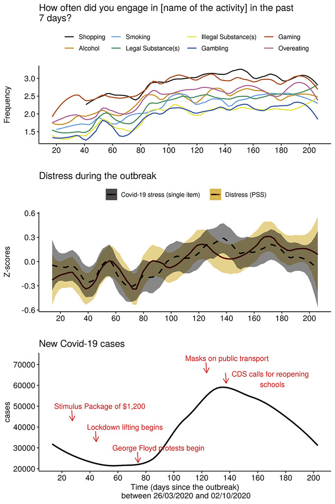

# Shopping and other addictions during Covid-19: an academic project

There comes the time in every *lucky* scientist's life when she has a one-and-only opportunity to test and apply the knowledge she researched (in theory) for 5+ years and wrote a PhD dissertation about. For me this opportunity presented itself at the beginning of the Covid-19 pandemic in the spring of 2020, just a year after giving birth to my triplets... My maternity leave was the perfect opportunity to challenge myself to find research tools in this unprecedented global challenge to study what no-one had the chance to do before: the trends of excessive behaviours (especially shopping addiction) under global and thus personal distress for an extended period. 

I gratefully acknowledge financial help  from the Alexander von Humboldt Foundation for data collection (but I had no personal financial benefit). I also had valuable academic support from the Diagnostik department of the Humboldt University of Berlin. I was the leader of the project, but received assistance in data analysis from Eva Katzinger (MA student at Humboldt University of Berlin) and consulted with my senior colleague, Sunghwan Yi, PhD (University of Guelph, Canada).

## Method
This analysis is based on a data collection during the first 6 months of the Covid-19 pandemic in the USA. Via MTurk we sampled 25 Americans every 3 days (never the same person) and administered our survey via formr (an R framework) to observe changes in the pattern. I implemented live data quality measures (including standard and not-so-standard attention check items), and in the end we obtained a final clean sample of 1430 participants.   

## Main findings
Can you see how closely most excessive behaviours increase or decrease according to baseline stress levels? 🤔  This is an indication, that excessive behaviours are likely to be stress-related. Our study is the first to have demonstrated this effect in a long-term (6 months!) design. Experimental studies "only" have to confirm this suspicion now :wink: 

Also, notice that shopping and gaming were the most popular activities throughout our datacollection period.

## Other findings
Findings were published in two separate articles. *Paper 1* is about the analysis of excessive behaviours during the time of data collection. Here we found that the frequency of self-reported excessive behaviours (shopping (compulsive buying), alcohol, smoking, legal substances, illegal substances, gambling, gaming and overeating) increased during the first six months of the pandemic (especially compulsive buying and gaming). The final paper (including beautiful visualisations!) is available in the Journal of Behavioral Addictions [under this link](https://akjournals.com/view/journals/2006/10/4/article-p912.xml?body=pdf-23898).  
 
*Paper 2* focuses specifically on shopping (compulsive buying) tendencies and its relationship to income, social status and credit status during the pandemic. This exciting paper is also already [available](https://www.ncbi.nlm.nih.gov/pmc/articles/PMC9109632/pdf/jba-11-088.pdf). 

## Technical Information
The data collection platform and automation was written in formr, and R framework. Data were analysed and visualised using R.

In order to comply with the Open Science Principles the protocol (and the study) was preregistered before data collection under the following link: https://osf.io/m5kw9. You can also find all data and scripts of analysis on the OSF and in this repo. 